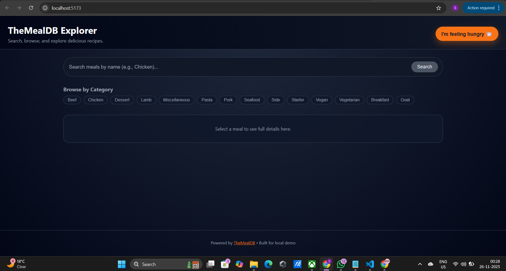
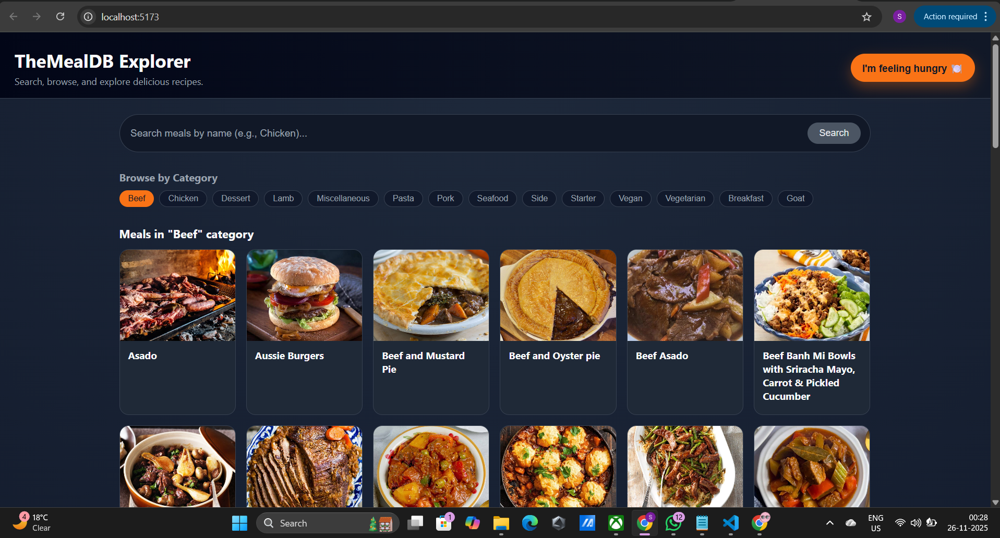
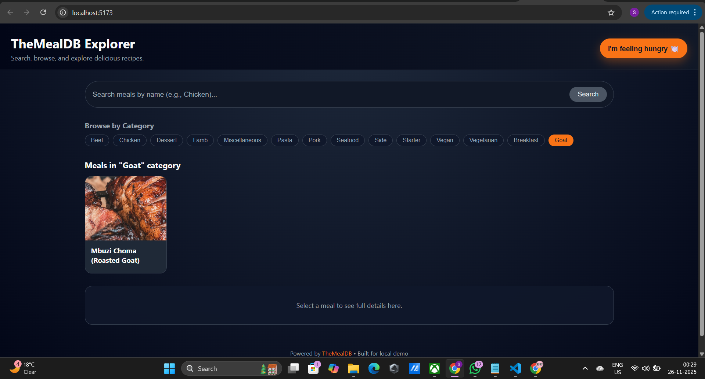

# 🍽️ TheMealDB Explorer

A complete full-stack recipe explorer application built using **React + Vite (Frontend)** and **Node.js + Express (Backend)**.  
The app fetches real-time data from **TheMealDB public API** and provides a rich user experience to explore recipes, discover random dishes, view ingredients, and watch cooking videos.

---

## 🚀 Features

✔ **Search Recipes** — Search meals by name  
✔ **Browse Categories** — Filter meals like Chicken, Seafood, Dessert, etc.  
✔ **Random Meal Generator** — “I’m feeling hungry 🍽️” gives a *different* meal every click  
✔ **Recipe Details Page** — Ingredients + Instructions + YouTube cooking video  
✔ **Smart Backend Caching** — Reduced API calls (except random meal)  
✔ **Responsive UI** — Works on mobile & desktop  
✔ **Clean RESTful Endpoints** — Proper request structure & error handling

---

## 🧱 Tech Stack

| Layer | Technology |
|-------|------------|
| Frontend | React, Vite, Axios |
| Backend | Node.js, Express |
| Cache | In-Memory (LRU + TTL) |
| API Provider | [TheMealDB API](https://www.themealdb.com/api.php) |

---

## 🏛️ Architecture Overview

Frontend (React + Axios)
│
▼
Backend (Express + Cache)
│
▼
External API (TheMealDB)

yaml
Copy code

### 💡 Caching Strategy

| API Feature         | Cache? | Why |
|---------------------|--------|-----|
| Random Meal         | ❌ No  | Must always return a new dish |
| Categories          | ✔ Yes | Rarely changes |
| Search Meals        | ✔ Yes | Frequent repeated queries |
| Meal By ID          | ✔ Yes | Details reused when reopened |
| Meals By Category   | ✔ Yes | List rarely changes |

> 🧠 **Random meals are intentionally NOT cached** to keep experience fun & surprising!

---

## 📁 Project Structure

| Location                              | Description                 |
| ------------------------------------- | --------------------------- |
| `backend/src/app.js`                  | Core Express setup          |
| `backend/src/server.js`               | Server start & port config  |
| `backend/src/routes/mealRoutes.js`    | API route definitions       |
| `backend/src/services/mealService.js` | Handles API calls + caching |
| `backend/src/utils/cache.js`          | In-memory cache logic       |
| `frontend/src/components/`            | UI components               |
| `frontend/src/api/`                   | Axios API calls             |
| `frontend/src/App.jsx`                | Main UI layout + routing    |
| `frontend/src/main.jsx`               | Bootstraps the React app    |
| `frontend/src/index.css`              | Global styling              |


---
# 🛠️ How to Run Locally

## 🔧 Backend Setup (Node + Express)
```bash
cd backend
npm install
npm run dev    
```

📌 **Backend runs at:**  
http://localhost:5000

---

## 🌐 Frontend Setup (React + Vite)
```bash
cd frontend
npm install
npm run dev
```

📌 **Frontend runs at:**  
http://localhost:5173

---

# 🔗 Available Backend API Endpoints

| Method | Endpoint                               | Description                        |
|--------|-----------------------------------------|------------------------------------|
| GET    | `/api/meals/search?name=pizza`          | Search meals by name               |
| GET    | `/api/categories`                       | Get all categories                 |
| GET    | `/api/categories/:c/meals`              | Get meals under a category         |
| GET    | `/api/meals/random`                     | Fetch a random meal (not cached)   |
| GET    | `/api/meals/:id`                        | Get recipe details by ID           |

---

# 🎥 UI Screenshots 







---

# 🧠 Design Highlights

- Backend acts as a middleware to **secure and optimize API calls**
- **Custom caching** improves performance and reduces API hits
- Follows **RESTful API design** principles
- Responsive **mobile + desktop UI**
- Robust **error handling** for invalid queries, missing data, and failed API calls

---

# 💡 Future Enhancements

- ⭐ Add Favorites using Local Storage  
- 🔐 Authentication + User Saved Recipes  
- 📱 Offline Mode (Service Workers)  
- 💨 Replace in-memory cache with Redis (production)  
- 🌙 Add Dark Mode toggle  

---

# 👨‍💻 Author

**Sandip Awale**  
📩 Email: awalesandip92@gmail.com 
🔗 LinkedIn: https://www.linkedin.com/in/sandipawale

❤️ Special credits to **TheMealDB** for providing open recipe data.
